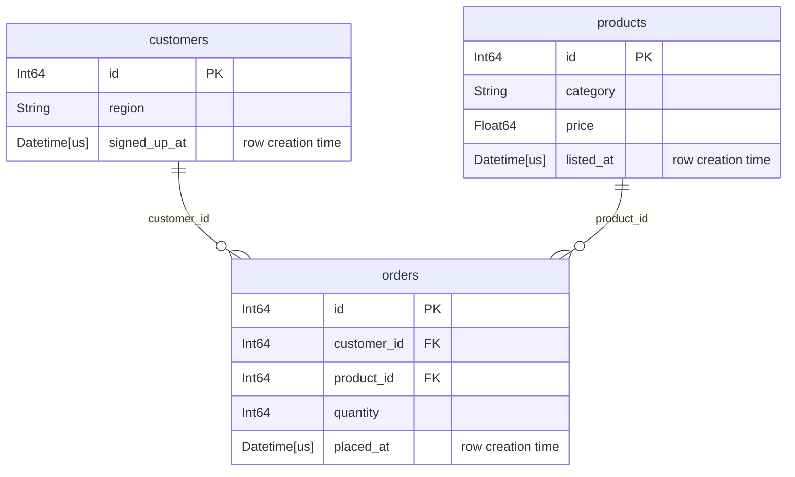

# tusk

In nature, narwhals use their tusk to find mates.
In data science, you can use tusk to connect dataframes via [narwhals](https://narwhals-dev.github.io/narwhals/).

This package helps to automate feature engineering with [Deep Feature Synthesis](https://groups.csail.mit.edu/EVO-DesignOpt/groupWebSite/uploads/Site/DSAA_DSM_2015.pdf) for (almost) any dataframe library.
Powered by [narwhals](https://narwhals-dev.github.io/narwhals/), inspired by [featuretools](https://featuretools.alteryx.com/).

## Install

```bash
uv add tusk-ml
```

## Usage

```python
from datetime import datetime

import tusk
from tusk.primitives import Quantiles

db = tusk.Database("shop")
db.add_table(
    "customers",
    customers_lf,
    primary_key="id",
    row_creation_time="signed_up_at",
)
db.add_table("products", products_lf, primary_key="id", row_creation_time="listed_at")
db.add_table("orders", orders_lf, primary_key="id", row_creation_time="placed_at")

db.add_relationship(parent="customers", child="orders", foreign_key="customer_id")
db.add_relationship(parent="products", child="orders", foreign_key="product_id")

db.validate()  # optional: confirm the keys really are keys, before you trust the numbers

feature_matrix, features = tusk.deep_feature_synthesis(
    database=db,
    target_table="customers",
    agg_primitives=["mean", "count", Quantiles(qs=(0.25, 0.5, 0.75))],
    trans_primitives=["month", "weekday"],
    max_depth=2,
    cutoff_time=datetime(2026, 1, 1),
)
```

`feature_matrix` comes back as an uncomputed query plan — tusk never collects —
so on a backend with a lazy frame type you get one back and decide when to
compute:

```python
matrix = feature_matrix.collect()
```

`features` is a `FeatureList` — a sequence of inspectable definitions that
knows its target table and can re-apply itself to new data:

```python
matrix = features.apply(db_new)
```

## Looking at the schema

`plot()` draws the database you just built. It runs no query against the data.

```python
db.plot()
```



In a notebook it renders inline; `print(db.plot())` gives the Mermaid source,
and `db.plot().save("schema.svg")` writes an image with `tusk-ml[plot]`
installed.

## Documentation

Full documentation lives [here](excidion.github.io/tusk/).
Or build the site locally with:
```bash
just docs-test
```
