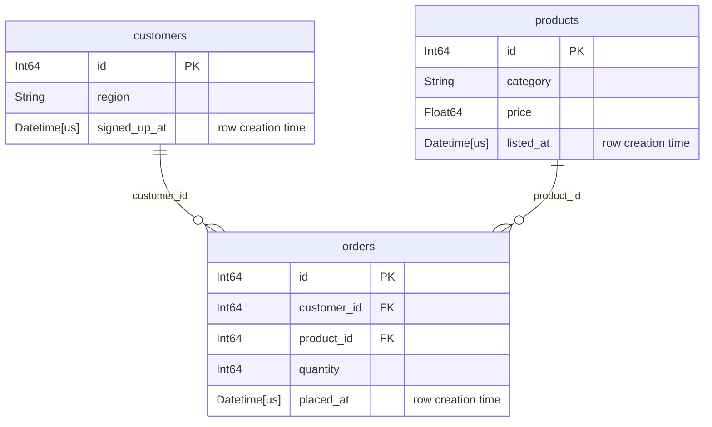

# Databases

A [`Database`][tusk.Database] holds the tables you want features over and the
relationships between them. By default it is pure schema: adding a table reads
its column names and dtypes, nothing else. No row is read unless you ask for
[validation](#validation).

```python
import tusk

db = tusk.Database("shop")
db.add_table(
    "customers", customers_lf, primary_key="id", row_creation_time="signed_up_at"
)
db.add_table("orders", orders_lf, primary_key="id", row_creation_time="placed_at")
db.add_relationship(parent="customers", child="orders", foreign_key="customer_id")
```

Both `add_table` and `add_relationship` return the database, so they chain.

## Keys

tusk uses `primary_key` and `row_creation_time` rather than featuretools'
`index` and `time_index`. Narwhals has no index concept, and
`row_creation_time` names what the column actually means: when the row became
knowable.

`primary_key` is **optional**, but a table without one cannot be a relationship
parent or a DFS target, and order-dependent primitives on it have
non-deterministic tiebreaks. Omitting it raises a
[`MissingPrimaryKeyWarning`][tusk.exceptions.MissingPrimaryKeyWarning].

`row_creation_time` is required for order-dependent primitives on that table,
and is what a [cutoff time](deep-feature-synthesis.md#cutoff-times) filters on. A table without
one is *timeless*: it passes through every cutoff unfiltered.

Keys are single columns. Passing a tuple or list raises
[`SchemaError`][tusk.exceptions.SchemaError] — there are no composite keys.

## Relationships

`add_relationship(parent=, child=, foreign_key=)` takes three arguments, not
two pairs. The parent side is always the parent's `primary_key`, so only the
child's column needs naming.

```python
db.add_relationship(parent="products", child="orders", foreign_key="product_id")
```

A relationship is one parent to many children. A table can be the child of
several parents, which is what gives DFS depth: `orders` hangs off both
`customers` and `products`, so a depth-2 walk from `customers` reaches product
columns by going down to orders and back up.

## Backends

One database uses one backend. The first table you add fixes it; a later
table on a different backend raises `SchemaError`, because narwhals cannot join
across backends.

Eagerness, by contrast, is not sticky and not remembered. `add_table` accepts
a native or narwhals frame in either form and immediately lazifies it, so an
eager frame and a lazy one are interchangeable — you can mix both forms of the
same backend in one database. Either way the feature matrix comes back
[uncomputed](deep-feature-synthesis.md#lazy-out-always).

## Validation

A database takes your declarations (mostly) on trust. Naming a column as `primary_key`
asserts that it identifies a row, but nothing confirms it. When the assertion is
false, tusk does not fail — a duplicated key fans out every join that lands on
the table, and `COUNT`, `SUM` and `MEAN` come back inflated by a factor you
cannot see.

[`validate()`][tusk.Database.validate] runs real queries to confirm the
declarations hold:
```python
db.validate()
```
It runs every check - each table, then each relationship, then the database
as a whole - and raises
[`ValidationError`][tusk.exceptions.ValidationError] on the first defect.

If you don't want to wait until the full database is assembled you can also validate during the creation:
```python
db.add_table("customers", customers_lf, primary_key="id", validate=True)
```
Per default, both `add_table` and `add_relationship` only run checks that do not require reading any data.
They just look at the table schemas and avoid costly queries.

This way you catch the most obvious errors early:
A key dtype mismatch is worth hearing about at the point you declare the link
rather than at the join.

```python
db.add_relationship(parent="customers", child="orders", foreign_key="customer_id")
# ValidationError: foreign_key 'customer_id' of 'orders' is String,
# but primary_key 'id' of 'customers' is Int64

db.add_relationship(..., validate=True)  # run all checks
db.add_relationship(..., validate=False)  # check nothing
```

A relationship that fails validation is not registered and as a table that fails is not added.

### Available checks

There are checks that

+ span the whole [database](/api/validation/#tusk.validation.DATABASE_CHECKS)
+ run against each [table](/api/validation/#tusk.validation.TABLE_CHECKS) .
+ cross check each [relationship](/api/validation/#tusk.validation.RELATIONSHIP_CHECKS)


## Looking at the schema

`plot()` draws the database as a Mermaid entity-relationship diagram. It reads
no rows, so it costs nothing:

```python
db.plot()
```

For the shop database above, that gives:



Each attribute row is the column's dtype, its name, its key marker, and a
comment. `PK` and `FK` are Mermaid's own markers; the `row_creation_time` gets
a comment instead, because Mermaid has no marker for it.

`1 to 0+` reads as one parent row to zero or more child rows. A child whose
`primary_key` *is* the foreign key can only ever match one parent row, and
that link reads `1 to zero or one` instead. Both come from the declared keys,
so neither costs a query.

In a notebook the diagram renders inline. Elsewhere, `print(db.plot())` gives
the Mermaid source, and `save()` writes a file:

```python
db.plot().save("schema.svg")
```

`.mmd` and `.md` write the source and need nothing installed. `.svg`, `.png`
and `.pdf` render the diagram and need the extra:

```bash
pip install tusk-ml[plot]
```

Wide tables make an unreadable picture. `columns="structural"` keeps only the
primary key, the foreign keys and the `row_creation_time`; `columns=False`
keeps only the table names and the lines between them:

```python
db.plot(columns="structural")
```

## Row update times

`row_creation_time` decides whether a **row** is visible at a cutoff. It says
nothing about the columns inside it. Take a table of taxi rides, where the row
appears when the ride is booked and several columns are filled in later, as the
ride happens:

| id | booked_at | picked_up_at | dropped_off_at | fare | tip |
| -- | --------- | ------------ | -------------- | ---- | --- |
| 1 | 11:58 | 12:03 | 12:25 | 24.50 | 3.00 |

Ask for features at a `cutoff_time` of 12:00 and the ride is visible, because it
was booked two minutes earlier. So is its fare — a number nobody knew until
12:25. Train on that and you are training on the answer.

`row_update_times` names the columns that were filled in later, and says what
each held before:

```python
db.add_table(
    "rides",
    rides,
    primary_key="id",
    row_creation_time="booked_at",
    row_update_times={
        "picked_up_at": {"picked_up_at": None},
        "dropped_off_at": {"fare": None, "tip": 0.0, "dropped_off_at": None},
    },
)
```

The outer key is a column recording when something happened to the ride. The
inner mapping lists the columns that moment filled in, each with the value it
held beforehand. At a cutoff of 12:00 the row now comes back with
`picked_up_at`, `dropped_off_at` and `fare` all null, and `tip` as `0.0`.

A null in an update time column means that moment never came — the ride was
never picked up — so the row keeps what it holds, at every cutoff.

### You choose the earlier value, not tusk

The table kept only the current value, so tusk cannot work out the earlier one.
`None` says the value was unknown, which is right for a fare nobody had
calculated yet. `0.0` is right for the tip, because no tip had been given — and
writing `None` there would quietly change every `SUM` and `MEAN` over tips.
Both are your knowledge of your own data, so choose each one deliberately.

### The update time describes itself too

`picked_up_at` is a column like any other, so `MAX(rides.picked_up_at)` would
report a pickup that has not happened yet. tusk therefore adds
`"picked_up_at": None` to the mapping when you leave it out, and warns with
[`ImplicitRowUpdateTimeMaskWarning`][tusk.exceptions.ImplicitRowUpdateTimeMaskWarning]
so you can choose a different value. Writing it yourself silences the warning.

### What cannot be filled in later

The primary key and the `row_creation_time` may not appear in a mapping. The
primary key is how a row is identified, and every visible row was created at or
before the cutoff already, so neither has an earlier value that means anything.

Foreign keys **may** be, and it is one of the more useful cases: a ride
reassigned to another driver after the cutoff, with its `driver_id` given an
earlier value of `None`, correctly stops counting towards either driver's
totals at that cutoff.

One update time may not be listed under another:

```python
row_update_times={
    "dropped_off_at": {"picked_up_at": None},   # refused
    "picked_up_at": {"fare": None},
}
```

This says the dropoff filled in the pickup time, and the pickup filled in the
fare. tusk works out every column in one pass, reading the times the table
actually holds, so at a cutoff of 12:10 the row would claim the pickup time is
unknown while still showing the 24.50 fare — a fare it only showed because that
same pickup time, read at face value, said the ride had already started. Each
column needs an update time that is known in its own right.

All three rules are checks that run by default, so a declaration like the one
above is refused when you add the table.

### The words the checks use

The checks are named in older vocabulary than this page: a column given an
earlier value is *masked*, and the value is its *fallback*. That is where
`singly_masked_columns`, `unmasked_primary_key` and `matching_fallback_dtypes`
get their names. See [validation](#validation) for running them by name.

### What tusk cannot see

A column that is overwritten in place and named in no `row_update_times` is
indistinguishable, to tusk, from one that is never touched. It will be read at
face value and it will leak. Nothing in a schema reveals which columns are
rewritten; only you know that.

This is also why a column that changes many times — a status that goes from
booked to accepted to completed — is a poor fit. `row_update_times` gives it
one earlier value for all time, and a column with a history has more than one.
Where you can, record each step in its own column, as `picked_up_at` and
`dropped_off_at` do above, or keep the history in a child table and let a
cutoff filter its rows.
