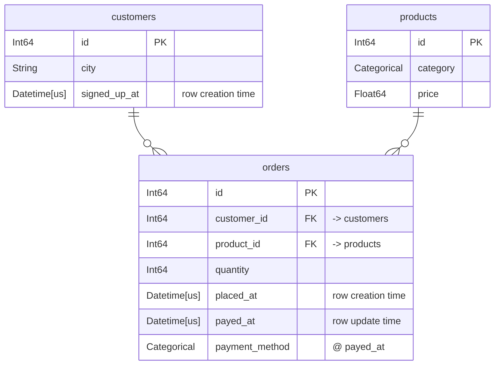
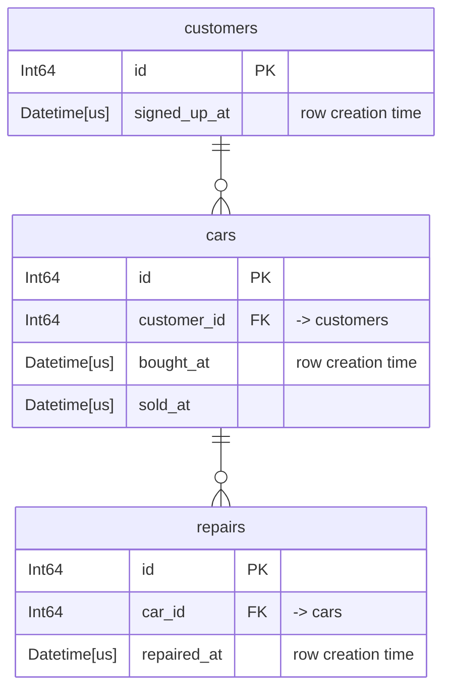

# Databases

A [`Database`][tusk.Database] holds the tables you want features over and the
relationships between them. By default it is pure schema: adding a table reads
its column names and dtypes, nothing else. No row is read unless you ask for
[validation](#validation).

```python
import tusk

db = tusk.Database("shop")
db.add_table(
    "customers", customers_lf, primary_key="id", row_creation_time="signed_up_at"
)
db.add_table("products", products_lf, primary_key="id")
db.add_table(
    "orders",
    orders_lf,
    primary_key="id",
    row_creation_time="placed_at",
    row_update_times={"payed_at": {"payed_at": None, "payment_method": None}},
)
db.add_relationship(parent="customers", child="orders", foreign_key="customer_id")
db.add_relationship(parent="products", child="orders", foreign_key="product_id")
```

Both `add_table` and `add_relationship` return the database, so they chain.

## Keys

tusk uses `primary_key` and `row_creation_time` rather than featuretools'
`index` and `time_index`. Narwhals has no index concept, and
`row_creation_time` names what the column actually means: when the row became
knowable.

`primary_key` is **optional**, but a table without one cannot be a relationship
parent or a DFS target, and
[ordered transform primitives][tusk.primitives.OrderedTransformPrimitive] on it
have non-deterministic tiebreaks. Omitting it raises a
[`MissingPrimaryKeyWarning`][tusk.exceptions.MissingPrimaryKeyWarning].

`row_creation_time` is required for
[ordered transform primitives][tusk.primitives.OrderedTransformPrimitive] on that table,
and is what a [cutoff time](deep-feature-synthesis.md#cutoff-times) filters on. A table without
one is *timeless*: it passes through every cutoff unfiltered.

Keys are single columns. Passing a tuple or list raises
[`SchemaError`][tusk.exceptions.SchemaError] — there are no composite keys.

## Relationships

`add_relationship(parent=, child=, foreign_key=)` takes three arguments, not
two pairs. The parent side is always the parent's `primary_key`, so only the
child's column needs naming.

```python
db.add_relationship(parent="products", child="orders", foreign_key="product_id")
```

A relationship is one parent to many children. A table can be the child of
several parents, which is what gives DFS depth: `orders` hangs off both
`customers` and `products`, so a depth-2 walk from `customers` reaches product
columns by going down to orders and back up.

## Backends

One database uses one backend. The first table you add fixes it; a later
table on a different backend raises `SchemaError`, because narwhals cannot join
across backends.

Eagerness, by contrast, is not sticky and not remembered. `add_table` accepts
a native or narwhals frame in either form and immediately lazifies it, so an
eager frame and a lazy one are interchangeable — you can mix both forms of the
same backend in one database. Either way the feature matrix comes back
[uncomputed](deep-feature-synthesis.md#lazy-out-always).

## Validation

A database takes your declarations (mostly) on trust. Naming a column as `primary_key`
asserts that it identifies a row, but nothing confirms it. When the assertion is
false, tusk does not fail — a duplicated key fans out every join that lands on
the table, and `COUNT`, `SUM` and `MEAN` come back inflated by a factor you
cannot see.

[`validate()`][tusk.Database.validate] runs real queries to confirm the
declarations hold:
```python
db.validate()
```
It runs every check - each table, then each relationship, then the database
as a whole - and raises
[`ValidationError`][tusk.exceptions.ValidationError] on the first defect.

If you don't want to wait until the full database is assembled you can also validate during the creation:
```python
db.add_table("customers", customers_lf, primary_key="id", validate=True)
```
Per default, both `add_table` and `add_relationship` only run checks that do not require reading any data.
They just look at the table schemas and avoid costly queries.

This way you catch the most obvious errors early:
A key dtype mismatch is worth hearing about at the point you declare the link
rather than at the join.

```python
db.add_relationship(parent="customers", child="orders", foreign_key="customer_id")
# ValidationError: foreign_key 'customer_id' of 'orders' is String,
# but primary_key 'id' of 'customers' is Int64

db.add_relationship(..., validate=True)  # run all checks
db.add_relationship(..., validate=False)  # check nothing
```

A relationship that fails validation is not registered and as a table that fails is not added.

### Available checks

There are checks that

+ span the whole [database](/api/validation/#tusk.validation.DATABASE_CHECKS)
+ run against each [table](/api/validation/#tusk.validation.TABLE_CHECKS) .
+ cross check each [relationship](/api/validation/#tusk.validation.RELATIONSHIP_CHECKS)


## Looking at the schema

`plot()` draws the database as a Mermaid entity-relationship diagram. It reads
no rows, so it costs nothing:

```python
db.plot()
```

For the shop database above, that gives:



Each attribute row is the column's dtype, its name, its key marker, and a
comment. `PK` and `FK` are Mermaid's own markers; everything else travels in
the comment, because Mermaid has no marker for it: the table a foreign key
points at, the `row_creation_time`, each
[`row_update_times`](#row-update-times) column, and `@ <update time>` on every
column that update time fills in.

`1 to 0+` reads as one parent row to zero or more child rows. A child whose
`primary_key` *is* the foreign key can only ever match one parent row, and
that link reads `1 to zero or one` instead. Both come from the declared keys,
so neither costs a query.

In a notebook the diagram renders inline. Elsewhere, `print(db.plot())` gives
the Mermaid source, and `save()` writes a file:

```python
db.plot().save("schema.svg")
```

`.mmd` and `.md` write the source and need nothing installed. `.svg`, `.png`
and `.pdf` render the diagram and need the extra:

```bash
pip install tusk-ml[plot]
```

Wide tables make an unreadable picture. `columns="structural"` keeps only the
primary key, the foreign keys, the `row_creation_time`, the `row_update_times`
and the columns they update; `columns=False`
keeps only the table names and the lines between them:

```python
db.plot(columns="structural")
```

## Row conditions: `where` and `when`

Sometimes only some of a table's rows should count. A customer's *open*
orders, or only their *large* ones, make a different feature than all their
orders put together. `where` and `when` name those conditions on the table
itself, so synthesis can build both:

```python
db.add_table(
    "orders",
    orders_lf,
    primary_key="id",
    row_creation_time="placed_at",
    where={"large": nw.col("amount") >= 100.0},
    when={"open": lambda cutoff: nw.col("closed_at").is_null()
                               | (nw.col("closed_at") > cutoff)},
)
```

`where` takes a static narwhals expression: a condition that does not depend
on the cutoff. `when` takes a callable that receives the cutoff time and
returns a narwhals expression, for a condition measured against it, such as
"still open" or "currently valid". A `when` condition needs a `cutoff_time` at
compile time; applying one without raises
[`ValidationError`][tusk.exceptions.ValidationError]. A condition key may not
contain `__`.

`add_table` only checks that a `where` value is a narwhals expression and a
`when` value is callable. It does not run the expression. A condition
referring to a column that does not exist is therefore not caught here — it
surfaces later, as an error from the dataframe backend, when the feature
matrix is computed.

`conditional_primitives` names the primitives computed over only the rows each
condition keeps. It is a separate list from `agg_primitives`, not a subset of
it: a primitive listed here gives you the conditional features alone, and you
list it in both to get the unconditional ones too. The default is
`("count", "sum")`, so a table that declares a condition gets conditional
counts and sums even when `agg_primitives` never mentions them:

```python
feature_matrix, features = tusk.deep_feature_synthesis(
    database=db,
    target_table="customers",
    conditional_primitives=("count", "sum"),
    cutoff_time=datetime(2026, 1, 1),
)

# adds, alongside the unconditional features:
#   COUNT(orders WHERE large)
#   SUM(orders.amount WHEN open)
```

### A condition only filters its own table

A condition on `cars` decides which cars count. It does not reach `repairs`:
by the time the condition applies, each car's repairs have already been
counted up.

Consider a garage database, where `cars` carries a `current` condition on
ownership:



```python
db.add_table(
    "cars",
    cars_lf,
    primary_key="id",
    row_creation_time="bought_at",
    when={
        "current": lambda cutoff: (
            nw.col("sold_at").is_null() | (nw.col("sold_at") > cutoff)
        ),
    },
)
```

Customer 2 currently owns car 1, which has four repairs on record, spread
across its whole lifetime. Customer 1's only car has since been sold, so none
of their cars count at all. The feature

```
SUM(cars.COUNT(cars.repairs) WHEN current)
```

reads as "over the cars this customer currently owns, each car's **lifetime**
repair count". All four of car 1's repairs count toward customer 2,
regardless of when each one happened — the `current` condition masks rows of
`cars`, and `repairs` is never filtered by it.

No condition can fix this. `repairs` has no `customer_id` and no knowledge of
ownership windows, so no predicate over its own columns can express "during
this customer's ownership". Splitting the repairs by owner requires an
interval join between `repaired_at` and the ownership window, which is a
different mechanism from masking.

This is not a defect introduced by `where`/`when`. A depth-2 aggregation
already rolls a child's whole history up to whichever parent its foreign key
currently points at; conditions make that existing attribution visible rather
than creating it.

Normalizing ownership into its own table does not fix it either. Modelling
ownership as `ownerships(car_id, customer_id, valid_from, valid_until)`
decides *which customer* a car belongs to in a window, but not *which
repairs*. Reaching repairs from customers still goes: aggregate `repairs`
onto `cars`, direct-feature onto `ownerships`, aggregate onto `customers` —
and that middle rollup is still the car's lifetime repair count, so every
ownership row inherits the car's whole history.

The split falls out of existing machinery in exactly one case: when
`repairs` already carries an `ownership_id`, so repairs hang off
`ownerships` directly rather than off `cars`. Deriving that key from
`repairs(car_id, repaired_at)` is itself an interval join, so this only
helps when the source data already materializes the link.

The general case — propagating an ancestor's validity window down to filter
descendant rows by their own timestamps — is tracked as
[issue #29](https://github.com/Excidion/tusk/issues/29).

## Row update times

`row_creation_time` decides whether a **row** is visible at a cutoff. It says
nothing about the columns inside it. Take a table of taxi rides, where the row
appears when the ride is booked and several columns are filled in later, as the
ride happens:

| id | booked_at | picked_up_at | dropped_off_at | fare | tip |
| -- | --------- | ------------ | -------------- | ---- | --- |
| 1 | 11:58 | 12:03 | 12:25 | 24.50 | 3.00 |

Ask for features at a `cutoff_time` of 12:00 and the ride is visible, because it
was booked two minutes earlier. So is its fare, a number nobody knew until
12:25. Train on that and you are training on the answer.
This would introduce **data leakage**, which can be avoided with `row_update_times`.

`row_update_times` names the columns that were filled in later, and says what
each held before:

```python
db.add_table(
    "rides",
    rides,
    primary_key="id",
    row_creation_time="booked_at",
    row_update_times={
        "picked_up_at": {"picked_up_at": None},
        "dropped_off_at": {"fare": None, "tip": 0.0, "dropped_off_at": None},
    },
)
```

The outer key is a column recording when something happened to the ride. The
inner mapping lists the columns that moment filled in, each with the value it
held beforehand. At a cutoff of 12:00 the row now comes back with
`picked_up_at`, `dropped_off_at` and `fare` all null, and `tip` as `0.0`.

A null in an update time column means that moment never came. The ride was
never picked up, so the row keeps what it holds, at every cutoff.

### You have to choose the earlier value

The table keeps only the current value, so tusk cannot work out the earlier one.
`None` says the value was unknown, which is right for a fare nobody had
calculated yet. `0.0` might be right for the tip, because no tip had been given.
The choice depends your knowledge of your own data.

### The update time describes itself too

If `picked_up_at` would be column like any other, `MAX(rides.picked_up_at)` would
report a pickup that has not happened yet. tusk therefore adds
`"picked_up_at": None` to the mapping by default, and warns with
[`ImplicitEarlierValueWarning`][tusk.exceptions.ImplicitEarlierValueWarning]
so you can choose a different value. Writing it yourself silences the warning.

### What cannot be filled in later

The primary key and the `row_creation_time` are not allowd to be updated.
The primary key is how a row is identified, and every visible row was created at or
before the cutoff already, so neither has an earlier value that means anything.

A foreign key can be filled in. Imagine a driver that is assigned only after the ride
was booked. Give `driver_id` an earlier value of `None` and the ride counts towards
nobody's totals at a cutoff taken before a driver accepted it.

One update time may not be listed under another:

```python
row_update_times = {
    "dropped_off_at": {"picked_up_at": None},  # refused
    "picked_up_at": {"fare": None},
}
```

### On multiple updates

A column that changes more than once is not something `row_update_times` can
describe. A ride status going from booked to accepted to completed has a
history, and the mapping gives a column one earlier value for all time. Record
each step in its own column, the way `picked_up_at` and `dropped_off_at` do
above. Or keep the history in a child table, where a cutoff filters the rows
normally.
