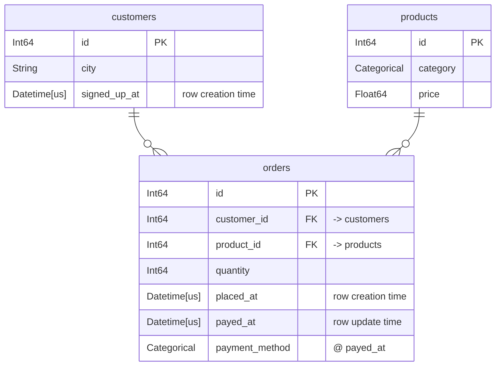
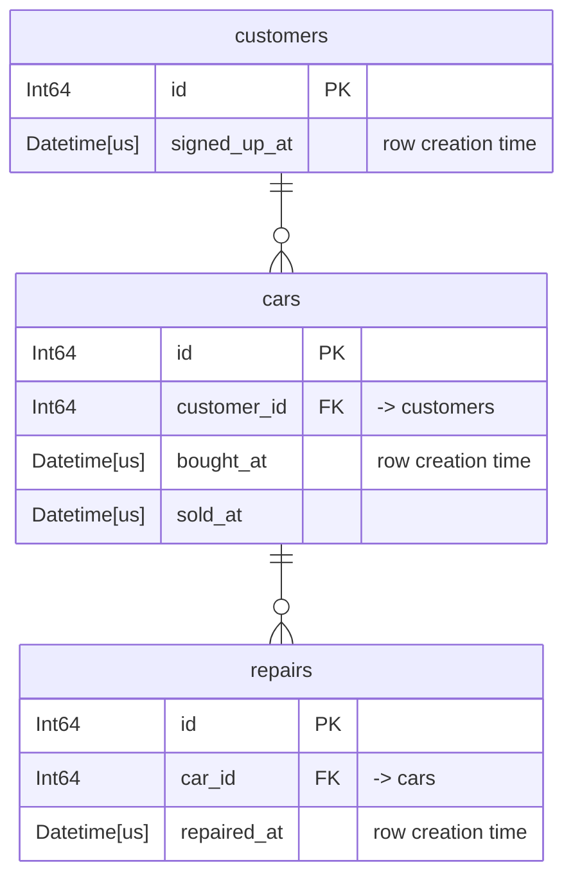

# Databases

A [`Database`][tusk.Database] holds the tables you build features from and the
relationships between them. `add_table` reads a table's column names and
dtypes. [Validation](#validation) looks at the rows.

```python
import tusk

db = tusk.Database("shop")
db.add_table(
    "customers", customers_lf, primary_key="id", row_creation_time="signed_up_at"
)
db.add_table("products", products_lf, primary_key="id")
db.add_table(
    "orders",
    orders_lf,
    primary_key="id",
    row_creation_time="placed_at",
    row_update_times={"payed_at": {"payed_at": None, "payment_method": None}},
)
db.add_relationship(parent="customers", child="orders", foreign_key="customer_id")
db.add_relationship(parent="products", child="orders", foreign_key="product_id")
```

Both `add_table` and `add_relationship` return the database, so they chain.

## Keys

`primary_key` identifies a row. `row_creation_time` records when the row
becomes visible.

`primary_key` is **optional**. A table without one cannot be a relationship
parent or a DFS target. The [ordered transform][tusk.primitives.OrderedTransformPrimitive]
and [ordered aggregation][tusk.primitives.OrderedAggregationPrimitive] primitives
on it also have non-deterministic tiebreaks. Omitting `primary_key` raises a
[`MissingPrimaryKeyWarning`][tusk.exceptions.MissingPrimaryKeyWarning].

The [ordered transform][tusk.primitives.OrderedTransformPrimitive] and
[ordered aggregation][tusk.primitives.OrderedAggregationPrimitive] primitives
on a table need its `row_creation_time`. A [cutoff time](deep-feature-synthesis.md#cutoff-times)
also filters on it. A table without one is *timeless*. It passes through
every cutoff time unfiltered.

Keys are single columns. There are no composite keys, so passing a tuple or
list raises [`SchemaError`][tusk.exceptions.SchemaError].

## Relationships

`add_relationship(parent=, child=, foreign_key=)` takes three arguments, not
two pairs. The parent side is always the parent's `primary_key`, so you name
only the child's column.

```python
db.add_relationship(parent="products", child="orders", foreign_key="product_id")
```

A relationship is one parent to many children. A table can be the child of
several parents. This gives DFS depth. `orders` connects to both `customers`
and `products`, so a depth-2 walk from `customers` reaches product columns by
going down to `orders` and back up.

## Backends

One database uses one backend. The first table you add determines it. A later
table on a different backend raises `SchemaError`, because narwhals cannot
join across backends.

`add_table` accepts either eager or lazy tables, native or narwhals. It
converts every table to lazy form when you add it. This lets you mix both
forms of the same backend in one database. The feature matrix always comes
back [the same way](deep-feature-synthesis.md#lazy-out-always).

## Validation

A database mostly trusts your declarations. When you name a column
`primary_key`, you assert that it identifies a row, but nothing checks
this. When the assertion is false, tusk does not fail. A duplicated key
multiplies the rows of every join that lands on the table. `COUNT`, `SUM`
and `MEAN` then come back inflated by a factor you cannot see.

[`validate()`][tusk.Database.validate] runs real queries to check that the
declarations hold:
```python
db.validate()
```
It runs every check: first each table, then each relationship, then the
database as a whole. It raises [`ValidationError`][tusk.exceptions.ValidationError]
on the first defect.

You do not have to wait until you build the whole database. You can also
pass `validate=True` when you add a table or relationship:
```python
db.add_table("customers", customers_lf, primary_key="id", validate=True)
```
By default, `add_table` and `add_relationship` only run checks that do not
read any data. They examine the table schemas and skip costly queries.

This way, you catch the most obvious errors early. You want to know about a
key dtype mismatch when you declare the link, not later at the join.

```python
db.add_relationship(parent="customers", child="orders", foreign_key="customer_id")
# ValidationError: foreign_key 'customer_id' of 'orders' is String,
# but primary_key 'id' of 'customers' is Int64

db.add_relationship(..., validate=True)  # run all checks
db.add_relationship(..., validate=False)  # check nothing
```

A failed check leaves the database as it was. The table or relationship that
failed the check is not part of the database.

### Available checks

There are checks that

+ span the whole [database](/api/validation/#tusk.validation.DATABASE_CHECKS)
+ run against each [table](/api/validation/#tusk.validation.TABLE_CHECKS)
+ cross-check each [relationship](/api/validation/#tusk.validation.RELATIONSHIP_CHECKS)


## Looking at the schema

`plot()` draws the database as a Mermaid entity-relationship diagram, from the
schema alone:

```python
db.plot()
```

For the shop database above, that gives:



Each attribute row is the column's dtype, its name, its key marker, and a
comment. `PK` and `FK` are Mermaid's own markers. Everything else travels in
the comment, because Mermaid has no marker for it. That includes the table a
foreign key points at, the `row_creation_time`, each
[`row_update_times`](#row-update-times) column, and `@ <update time>` on every
column that update time fills in.

`1 to 0+` reads as one parent row to zero or more child rows. A child whose
`primary_key` *is* the foreign key can only ever match one parent row. That
link reads `1 to zero or one` instead. Both come from the declared keys, so
neither costs a query.

In a notebook the diagram renders inline. Elsewhere, `print(db.plot())` gives
the Mermaid source. `save()` writes a file:

```python
db.plot().save("schema.svg")
```

`.mmd` and `.md` write the source and need nothing installed. `.svg`, `.png`
and `.pdf` render the diagram and need the extra:

```bash
pip install tusk-ml[plot]
```

Wide tables make an unreadable picture. `columns="structural"` keeps only the
primary key, the foreign keys, the `row_creation_time`, the `row_update_times`,
and the columns they update. `columns=False` keeps only the table names and
the lines between them:

```python
db.plot(columns="structural")
```

## Row conditions: `where` and `when`

Sometimes only some of a table's rows should count. A customer's *open*
orders, or only their *large* ones, make a different feature than all their
orders combined. `where` and `when` name those conditions on the table
itself, so synthesis can build both:

```python
db.add_table(
    "orders",
    orders_lf,
    primary_key="id",
    row_creation_time="placed_at",
    where={"large": nw.col("amount") >= 100.0},
    when={
        "open": lambda cutoff: (
            nw.col("closed_at").is_null() | (nw.col("closed_at") > cutoff)
        )
    },
)
```

Use `where` for a condition that means the same thing at every cutoff time,
like an amount threshold. Use `when` for one you measure against the
cutoff time itself, like "still open at the time we ask". `when` receives
the cutoff time and returns the expression. Synthesis needs a `cutoff_time`
to apply it. Without one, synthesis raises
[`ValidationError`][tusk.exceptions.ValidationError].

`conditional_primitives` names the primitives computed over only the rows each
condition keeps:

```python
feature_matrix, features = tusk.deep_feature_synthesis(
    database=db,
    target_table="customers",
    conditional_primitives=("count", "sum"),
    cutoff_time=datetime(2026, 1, 1),
)

# adds, alongside the unconditional features:
#   COUNT(orders WHERE large)
#   SUM(orders.amount WHEN open)
```

The expressions run when the compiler computes the feature matrix. A
misspelled column name then surfaces as an error from your backend.

### A condition only filters its own table

A condition picks rows only from the table where you declare it. Everything
already aggregated up from that table's children stays whole.

Consider a garage database, where `cars` carries a `current` condition on
ownership:



```python
db.add_table(
    "cars",
    cars_lf,
    primary_key="id",
    row_creation_time="bought_at",
    when={
        "current": lambda cutoff: (
            nw.col("sold_at").is_null() | (nw.col("sold_at") > cutoff)
        ),
    },
)
```

Customer 2 currently owns car 1, which has four repairs, spread across its
whole lifetime. Customer 1's only car was sold, so none of their cars count
at all. The feature

```
SUM(cars.COUNT(cars.repairs) WHEN current)
```

reads as "over the cars this customer currently owns, each car's **lifetime**
repair count". Customer 2 gets all four repairs, including the ones from
before they bought the car.

To count only the repairs from the ownership window, `repairs` needs a
column naming the owner at repair time. It also needs a condition of its own
over that column. Computing such a column from `car_id` and `repaired_at`
alone requires an interval join, tracked as
[issue #29](https://github.com/Excidion/tusk/issues/29).

## Row update times

`row_creation_time` decides whether a **row** is visible at a cutoff time. It
says nothing about the columns inside it. Take a table of taxi rides, where
the row appears when the ride is booked, and several columns are filled in
later, as the ride happens:

| id | booked_at | picked_up_at | dropped_off_at | fare | tip |
| -- | --------- | ------------ | -------------- | ---- | --- |
| 1 | 11:58 | 12:03 | 12:25 | 24.50 | 3.00 |

Ask for features at a `cutoff_time` of 12:00, and the ride is visible,
because it was booked two minutes earlier. So is its fare, a number nobody
knew until 12:25. If you train on that, you train on the answer. This is
**data leakage**. `row_update_times` can prevent it.

`row_update_times` names the columns filled in later and says what each held
before:

```python
db.add_table(
    "rides",
    rides,
    primary_key="id",
    row_creation_time="booked_at",
    row_update_times={
        "picked_up_at": {"picked_up_at": None},
        "dropped_off_at": {"fare": None, "tip": 0.0, "dropped_off_at": None},
    },
)
```

The outer key is a column that records when something happened to the ride.
The inner mapping lists the columns that moment filled in, each with the
value it held beforehand. At a cutoff time of 12:00 the row now comes back
with `picked_up_at`, `dropped_off_at` and `fare` all null, and `tip` as
`0.0`.

A null in an update time column means that moment never came. The ride was
never picked up, so the row keeps what it holds, at every cutoff time.

### You have to choose the earlier value

The table keeps only the current value, so tusk cannot compute the earlier
one. `None` marks the value as null, which fits a fare nobody had computed
yet. `0.0` might be right for the tip, because no tip had been given. The
choice depends on your knowledge of your own data.

### The update time describes itself too

If tusk treated `picked_up_at` like any other column, `MAX(rides.picked_up_at)`
would report a pickup that has not happened yet. tusk therefore adds
`"picked_up_at": None` to the mapping by default. It also warns with
[`ImplicitEarlierValueWarning`][tusk.exceptions.ImplicitEarlierValueWarning],
so you can choose a different value. If you write this entry yourself, tusk
does not raise the warning.

### What cannot be filled in later

You cannot update the primary key or the `row_creation_time`. The primary
key identifies a row, and every visible row exists at or before the
cutoff time. So neither has an earlier value that means anything.

You can fill in a foreign key later. Imagine a driver assigned only after
someone books the ride. If you give `driver_id` an earlier value of `None`,
the ride counts towards nobody's totals at a cutoff time taken before a
driver accepted it.

You may not list one update time under another:

```python
row_update_times = {
    "dropped_off_at": {"picked_up_at": None},  # refused
    "picked_up_at": {"fare": None},
}
```

### On multiple updates

`row_update_times` handles a column that is updated once: it holds one
earlier value for all time. A ride status can go from booked to accepted to
completed. Record each step in its own column, the way `picked_up_at` and
`dropped_off_at` do above. Or keep the history in a child table, where a
cutoff time filters the rows normally.
