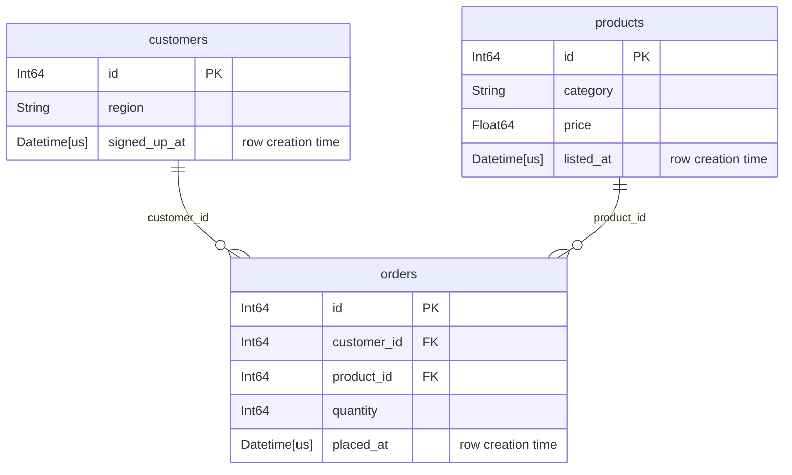

# Databases

A [`Database`][tusk.Database] holds the tables you want features over and the
relationships between them. By default it is pure schema: adding a table reads
its column names and dtypes, nothing else. No row is read unless you ask for
[validation](#validation).

```python
import tusk

db = tusk.Database("shop")
db.add_table(
    "customers", customers_lf, primary_key="id", row_creation_time="signed_up_at"
)
db.add_table("orders", orders_lf, primary_key="id", row_creation_time="placed_at")
db.add_relationship(parent="customers", child="orders", foreign_key="customer_id")
```

Both `add_table` and `add_relationship` return the database, so they chain.

## Keys

tusk uses `primary_key` and `row_creation_time` rather than featuretools'
`index` and `time_index`. Narwhals has no index concept, and
`row_creation_time` names what the column actually means: when the row became
knowable.

`primary_key` is **optional**, but a table without one cannot be a relationship
parent or a DFS target, and order-dependent primitives on it have
non-deterministic tiebreaks. Omitting it raises a
[`MissingPrimaryKeyWarning`][tusk.exceptions.MissingPrimaryKeyWarning].

`row_creation_time` is required for order-dependent primitives on that table,
and is what a [cutoff time](deep-feature-synthesis.md#cutoff-times) filters on. A table without
one is *timeless*: it passes through every cutoff unfiltered.

Keys are single columns. Passing a tuple or list raises
[`SchemaError`][tusk.exceptions.SchemaError] — there are no composite keys.

## Relationships

`add_relationship(parent=, child=, foreign_key=)` takes three arguments, not
two pairs. The parent side is always the parent's `primary_key`, so only the
child's column needs naming.

```python
db.add_relationship(parent="products", child="orders", foreign_key="product_id")
```

A relationship is one parent to many children. A table can be the child of
several parents, which is what gives DFS depth: `orders` hangs off both
`customers` and `products`, so a depth-2 walk from `customers` reaches product
columns by going down to orders and back up.

## Backends

One database uses one backend. The first table you add fixes it; a later
table on a different backend raises `SchemaError`, because narwhals cannot join
across backends.

Eagerness, by contrast, is not sticky and not remembered. `add_table` accepts
a native or narwhals frame in either form and immediately lazifies it, so an
eager frame and a lazy one are interchangeable — you can mix both forms of the
same backend in one database. Either way the feature matrix comes back
[uncomputed](deep-feature-synthesis.md#lazy-out-always).

## Validation

A database takes your declarations (mostly) on trust. Naming a column as `primary_key`
asserts that it identifies a row, but nothing confirms it. When the assertion is
false, tusk does not fail — a duplicated key fans out every join that lands on
the table, and `COUNT`, `SUM` and `MEAN` come back inflated by a factor you
cannot see.

[`validate()`][tusk.Database.validate] runs real queries to confirm the
declarations hold:
```python
db.validate()
```
It runs every check - each table, then each relationship, then the database
as a whole - and raises
[`ValidationError`][tusk.exceptions.ValidationError] on the first defect.

If you don't want to wait until the full database is assembled you can also validate during the creation:
```python
db.add_table("customers", customers_lf, primary_key="id", validate=True)
```
Per default, both `add_table` and `add_relationship` only run checks that do not require reading any data.
They just look at the table schemas and avoid costly queries.

This way you catch the most obvious errors early:
A key dtype mismatch is worth hearing about at the point you declare the link
rather than at the join.

```python
db.add_relationship(parent="customers", child="orders", foreign_key="customer_id")
# ValidationError: foreign_key 'customer_id' of 'orders' is String,
# but primary_key 'id' of 'customers' is Int64

db.add_relationship(..., validate=True)  # run all checks
db.add_relationship(..., validate=False)  # check nothing
```

A relationship that fails validation is not registered and as a table that fails is not added.

### Available checks

There are checks that

+ span the whole [database](/api/validation/#tusk.validation.DATABASE_CHECKS)
+ run against each [table](/api/validation/#tusk.validation.TABLE_CHECKS) .
+ cross check each [relationship](/api/validation/#tusk.validation.RELATIONSHIP_CHECKS)


## Looking at the schema

`plot()` draws the database as a Mermaid entity-relationship diagram. It reads
no rows, so it costs nothing:

```python
db.plot()
```

For the shop database above, that gives:



Each attribute row is the column's dtype, its name, its key marker, and a
comment. `PK` and `FK` are Mermaid's own markers; the `row_creation_time` gets
a comment instead, because Mermaid has no marker for it.

`1 to 0+` reads as one parent row to zero or more child rows. A child whose
`primary_key` *is* the foreign key can only ever match one parent row, and
that link reads `1 to zero or one` instead. Both come from the declared keys,
so neither costs a query.

In a notebook the diagram renders inline. Elsewhere, `print(db.plot())` gives
the Mermaid source, and `save()` writes a file:

```python
db.plot().save("schema.svg")
```

`.mmd` and `.md` write the source and need nothing installed. `.svg`, `.png`
and `.pdf` render the diagram and need the extra:

```bash
pip install tusk-ml[plot]
```

Wide tables make an unreadable picture. `columns="structural"` keeps only the
primary key, the foreign keys and the `row_creation_time`; `columns=False`
keeps only the table names and the lines between them:

```python
db.plot(columns="structural")
```
